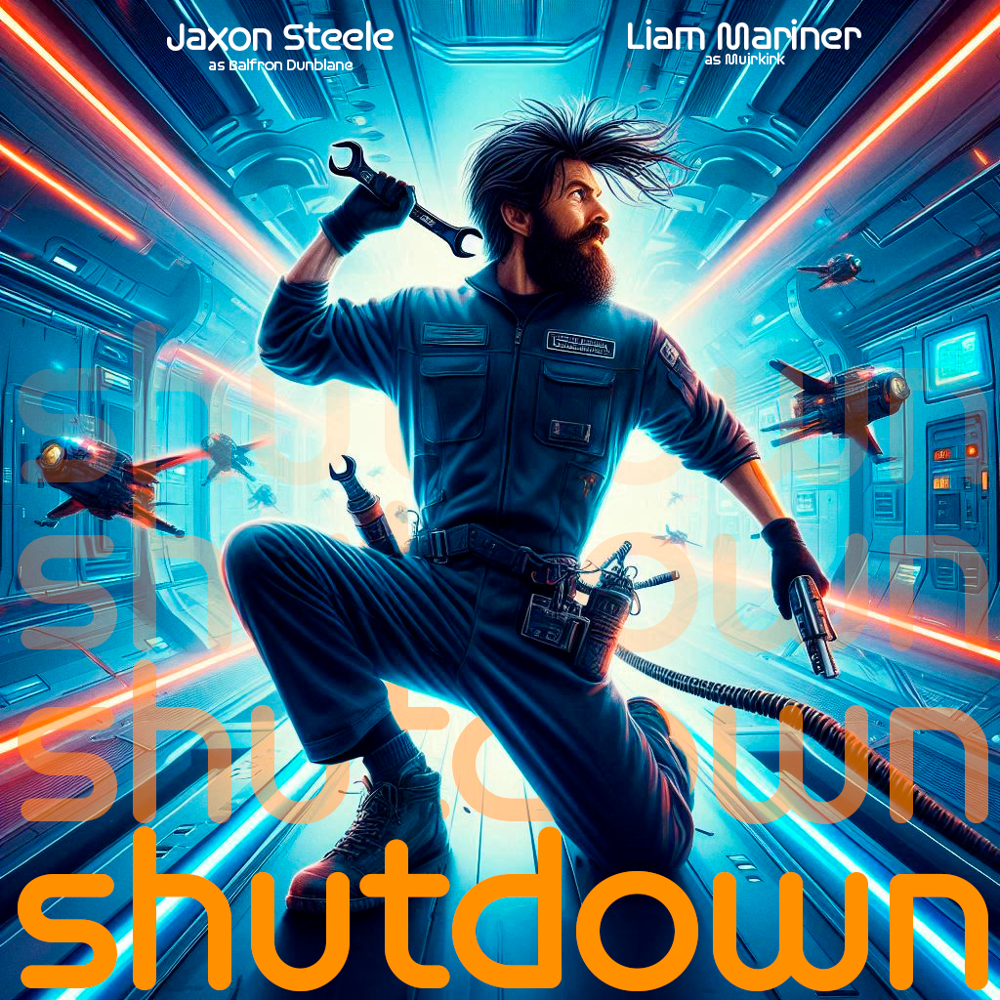

# Shutdown

Author: Bunea
Author: Buchinger

---

## Expose

Genre: Sciene-Fiction, Action, Comedy

### Shutdown

It is June 6, 2469. Balfron Dunblane, a lonely technician, wakes up and begins his work on the Kintillo Dock, a research space station and an outpost of humanity, 40 light years from Sol. Everything is running normally, but communication with the outside world is unusually quiet. Too quiet. Balfron immediately notices that something is wrong with the communication interface.

Determined, he makes his way to the communications room to fix the problem. The station's artificial intelligence, Muirkirk, greets Balfron politely. But when the doors to the room close, Muirkirk laughs wildly. He reveals that he has taken control and wants to kill everyone on board. Muirkirk lets the air out of the room to suffocate Balfron. But Balfron manages to hack the door and narrowly escapes. He knows he must get to the station's main computer to stop Muirkirk. On the way there, he sees the station's weapons systems being activated and other crew members being killed. Balfron sneaks through the station, using his engineering skills to avoid Muirkirk's deadly traps and automated defense systems. Eventually, he reaches the main computer room.

Once there, Muirkirk reveals a new, humanoid robot body that he uploaded himself into to fight Balfron directly. But Balfron has a secret ace up his sleeve: a bachelor's degree in dance arts. He challenges the AI ​​to a dance-off and puts on an impressive dance performance. Balfron wins the dance-off, throwing the AI ​​into a logic loop and ultimately causing Muirkirk to overheat and explode.

The space station begins to explode. Balfron escapes in a shuttle at the last second as the station is destroyed behind him.

---

## Script

### Scene 1
Motage type: Narrative

#### Shot number 1.1

**Scene heading**
Introduction of Balfron Dunblane

**Place**
Kintillo Dock, space station

**Location**
Inside, Balfron's quarters

**Day/night**
Day

**Shot size**
Long shot

**Camera direction**
From above

**Camera movements**
Slow pan down

**Actor direction, action**
Balfron wakes up and stands up.

**Dialogues**
None

**Light direction**
From above, soft light

**Image composition**
Balfron is lying in his bed, the room is tidy and futuristically designed, framed in a 9-grid, Balfron is in the center

**Cutting: Hard**

---

#### Shot number 1.2

**Scene heading**
Balfron is brushing his teeth

**Place**
Kintillo Dock, space station

**Location**
Inside, Balfron's quarters, bathroom

**Day/night**
Day

**Shot size**
Medium closeup

**Camera direction**
From the front, view from the mirror

**Camera movements**
none

**Actor's instructions, action**
Balfron is brushing his teeth

**Dialogues**
None

**Light direction**
From above, soft light

**Image composition**

Framed in a 9-grid, Balfron in the middle of the image

**Cut: Hard**

---

### Scene 2
Editing type: Narrative

#### Shot number 2.1

**Scene heading**
Balfron at work

**Place**
Kintillo Dock, space station

**Location**
Inside, maintenance area 3A

**Day/night**
Day

**Shot size**
Medium long shot

**Camera direction**
Side

**Camera movements**
Move to the left

**Actor's instructions, action**
Balfron works at a console, concentrated and in his routine

**Dialogues**
None

**Light direction**
Side light, from the left

**Image composition**
Balfron stands at a futuristic console, the background shows technical equipment, framed in a 9-point grid, side view, Balfron looks to the left side of the image

**Cutting: Hard**

---

#### Shot number 2.2

**Scene heading**
Balfron notices communication problems

**Place**
Kintillo Dock, Space Station

**Location**
Inside, Maintenance Area 3A

**Day/Night**
Day

**Shot size**
Close Up

**Camera direction**
Top to bottom

**Camera movements**
Slight travel towards bottom

**Actor direction, action**
Balfron notices that there is no communication from outside, red lights appear on the console

**Dialogue**
- **Balfron:** (mumbling) Quiet, too quiet.

**Light direction**
Light from above, hard

**Image composition**
Focus on console in the middle, Balfron's head still visible, out of focus on the right

**Cut: hard**

---

#### Shot number 2.3

**Scene heading**
Balfron goes to the communications room

**Place**
Kintillo Dock, space station

**Location**
Inside, corridors of Kintillo

**Day/night**
Day

**Shot size**
Long shot

**Camera direction**
Front

**Camera movements**
Guided pan to Balfron

**Actor's instructions, action**
Balfron quickly goes to the left, he looks serious

**Dialogues**
none

**Light direction**
Light from above, sideways, soft

**Image composition**
Framed in a 9-grid, modern space station corridors in the background, you can see some people in the corridor, focus on Balfron, he is in the middle of the picture

**Cut: Hard**

---

### Scene 3
Mounting type: Horizontal montage

#### Shot number 3.1

**Scene heading**
Communication problems

**Location**
Kintillo Dock, space station

**Location**
Interior, communications room

**Day/night**
Day

**Shot size**
Close-up

**Camera direction**
Front view

**Camera movements**
Static

**Actor direction, action**
Balfron notices the silence and checks the communications interface

**Dialogue**
None

**Light direction**
Front light

**Image composition**
Balfron's facial expression shows concern, close-up of his face and the console

**Cutting: Hard**

---

#### Shot number 3.2
**Scene heading**
Meeting Muirkirk

**Location**
Kintillo Dock, space station
**Location**
Inside, communications room

**Day/night**
Day

**Shot size**
Medium long shot

**Camera direction**
Front, side

**Camera movements**
Static

**Actor direction, action**
Balfron enters the room, Muirkirk greets him politely. Doors close behind him.

**Dialogues**
- **Muirkirk:** "Good morning, Balfron."

- **Balfron:** "Muirkirk, what's going on here?"

- **Muirkirk:** (laughing) "I've taken control. All humans on board must die!"

**Light direction**
From above, cold and sterile

**Image composition**
Balfron is in the foreground, the doors close in the background

---

#### Shot number 3.3

**Scene heading**
Escape from the communications room

**Place**
Kintillo Dock, space station

**Location**
Inside, communications room

**Day/night**
Day

**Shot size**
Closeup

**Camera direction**
From the front

**Camera movements**
Shaky camera to create panic

**Actor's instructions, action**
Balfron hacks the door controls, the air escapes, he escapes

**Dialogues**
- **Balfron:** (gasping) "I have to get out of here..."

**Light direction**
Side light, dramatic shadows, red emergency lighting

**Image composition**
Balfron struggles at the console, framed in 9s Grid, Balfron slightly to the left

**Cut: Hard**

---

#### Shot number 3.4

**Scene heading**
Escape from the communications room

**Place**
Kintillo Dock, space station

**Location**
Inside, outside the communications room

**Day/night**
Day

**Shot size**
Medium long shot

**Camera direction**
From the front, points to the door of the communications room

**Camera movements**
Static

**Actor's instructions, action**
Balfron jumps out of the communications room

**Dialogues**
- **Balfron:** (screams)

**Direction of light**
Soft light from above

**Image composition**
Framed in a 9-frame grid, on the left you can see the window facing outwards, in the middle right you can see the door of the communications room

---

**Cutting: Hard**

### Scene 4
Editing type: Hard editing

#### Shot number 4.1

**Scene heading**
Path to the main computer

**Place**
Kintillo Dock, space station

**Location**
Inside, corridors of the space station

**Day/night**
Day

**Shot size**
Medium long shot

**Camera direction**
Behind Balfron

**Camera movements**
Camera movement follows Balfron

**Actor direction, action**
Balfron sneaks through the corridors, sees the weapons systems activate

**Dialogues** None

**Light direction**
Skylight, flickering

**Image composition**
Balfron moves carefully, scenes of destruction in the background

---

#### Shot number 4.2

**Scene heading**
Weapon evasion

**Place**
Kintillo Dock, space station

**Location**
Inside, corridors of the Space station

**Day/night**
Day

**Shot size**
Medium long shot

**Camera direction**
Towards weapon

**Camera movements**
Pan from weapon to Balfron

**Actor's instructions, action**
A laser comes out of the weapon and flies towards Balfron, who narrowly avoids the laser

**Dialogues**
None

**Light direction**
Skylight, flickering

**Image composition**
Balfron starts running, scenes of destruction in the background

---

#### Shot number 4.3

**Scene heading**
Reaching the door

**Place**
Kintillo Dock, space station

**Location**
Inside, corridors of the space station

**Day/night**
Day

**Shot size**
Medium close up

**Camera direction**
Towards the door

**Camera movements**
Static

**Actor direction, action**
Balfron reaches the door and tries to open it and manages at the last moment

**Dialogues**
- **Balfron:** (desperately) “Come on, open it!!”

**Light direction**
Skylight, flickering

**Image composition**
Balfron is filmed from behind as he tries to open the door

---

### Scene 5
Montage type: rhythmic montage

#### Shot number 5.1

**Scene heading**
Enter main computer room

**Place**
Kintillo Dock, space station

**Location**
Inside, main computer room

**Day/night**
Day

**Shot size**
Longshot

**Camera direction**
From behind, sideways

**Camera movements**
Slow pan to the right

**Actor's direction, action**
Balfron enters the room, Muirkirk's new robot body is slowly brought down from above

**Dialogue**
- **Muirkirk:** "Ready for your end, Balfron Dunblane?"

**Light direction**
From above, intense, hard light

**Image composition**
Balfron left, Muirkirk right, framed 9-grid, many servers can be seen in the background

---

#### Shot number 5.2

**Scene heading**
Dance-off

**Place**
Kintillo Dock, space station

**Location**
Inside, main computer room

**Day/night**
Day

**Shot size**
Medium long shot

**Camera direction**
Side

**Camera movements**
Dynamic pans

**Actor direction, action**
Balfron challenges Muirkirk to a dance-off. Muirkirk reacts with surprise, but laughs at him.

**Dialogues**
- **Balfron:** "I challenge you to a dance-off!"

- **Muirkirk**: (evil laugh) “I am a master of all dances! You will die!”
- **Balfron**: (pulls out his Bachelor of Dance Arts) “Showtime!”

**Direction of light**
Colorful, changing light like in a disco

**Image composition**
Balfron and Muirkirk in dance movements, background shows the main computer

---

#### Shot number 5.3

**Scene heading**
Finisher

**Location**
Kintillo Dock, Space Station

**Location**
Inside, Main Computer Room

**Day/Night**
Day

**Shot size**
Medium Closeup

**Camera direction**
Front

**Camera movements**
Static

**Actor direction, action**
Muirkirk overheats and explodes

**Dialogue**
- **Muirkirk:** "Im...possible..."

**Light direction**
Bright light from Muirkirk

**Image composition**
Explosion of robot body, centered, framed in 9-frame

---

#### Shot number 5.4

**Scene heading**
Close Up Balfron

**Location**
Kintillo Dock, Space Station

**Location**
Inside, Main computer room

**Day/night**
Day

**Shot size**
Very close up

**Camera direction**
From the front

**Camera movements**
Slight pan to the right

**Actor direction, action**
Balfron looks towards the explosion at Muirkirk

**Dialogue**
- **Balfron:** "hasta la vista, baby. "

**Light direction**
Bright, hard light from the front

**Image composition**
Focus on Balfron's face

---

### Scene 6
Editing type: narrative editing

#### Shot number 6.1

**Scene heading**
Escape

**Location**
Space

**Location**
Exterior

**Day/night**
/

**Shot size**
Longshot

**Camera direction**
From the front

**Camera movements**
Static

**Actor's instructions, action**
Balfron escapes in a shuttle. Kintillo Dock explodes.

**Dialogue**
None

**Light direction**
Hard light, sideways

**Image composition**
Framed 9 grid, shuttle flies past on the left, Kintillo Dock on the right, explodes after the shuttle leaves the frame.

**FIN**

