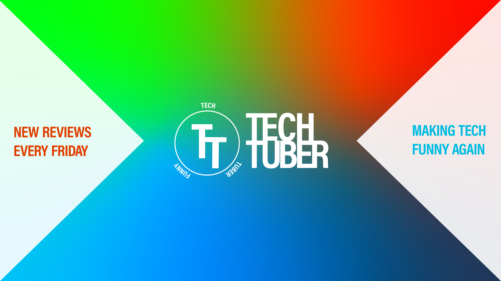
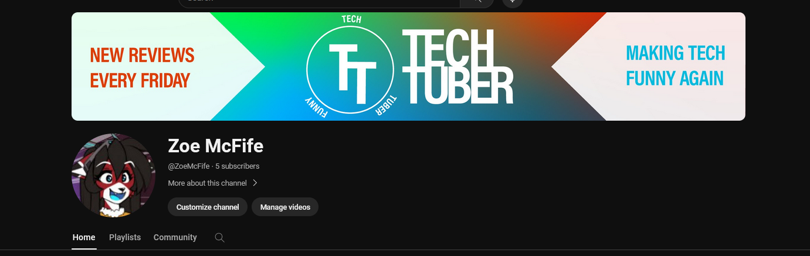

# Aufmerksamskeitsreize

In diesem Banner wurden folgende Aufmerksamkeitsreize verwendet:

- **Starker Kontrast**

    * Helle Farben kontrastieren mit dem Weiß auf den Seiten
    * Verwendung von Komplementären Farben im Gradient und beim Text

- **Reizintensität**

- **Keine Hohe Komplexität**

    * Gestaltung des Banners ist einfach
    * Besteht nur aus
        * 2 Dreiecken
        * Gradient Hintergrund
        * Logo
        * Text

- **Regelmäßigkeit**

    * Symmetrieachse in der Mitte

- **Einbeziehung**

    * Text gibt Grundinformation des Youtube Channels
    * Dreicke bilden Pfeile die, die Sicht zur Mitte zum Logo führt

## Beispiel auf Youtube

