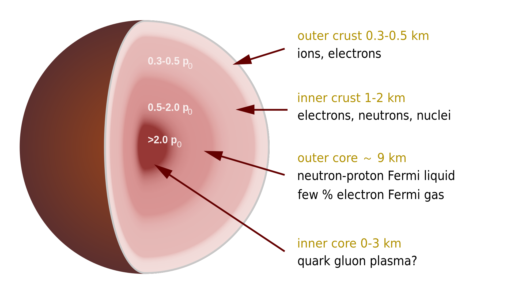
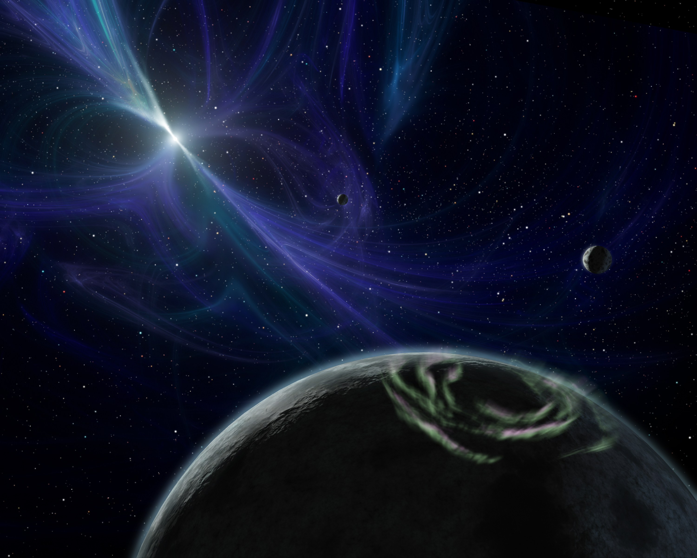
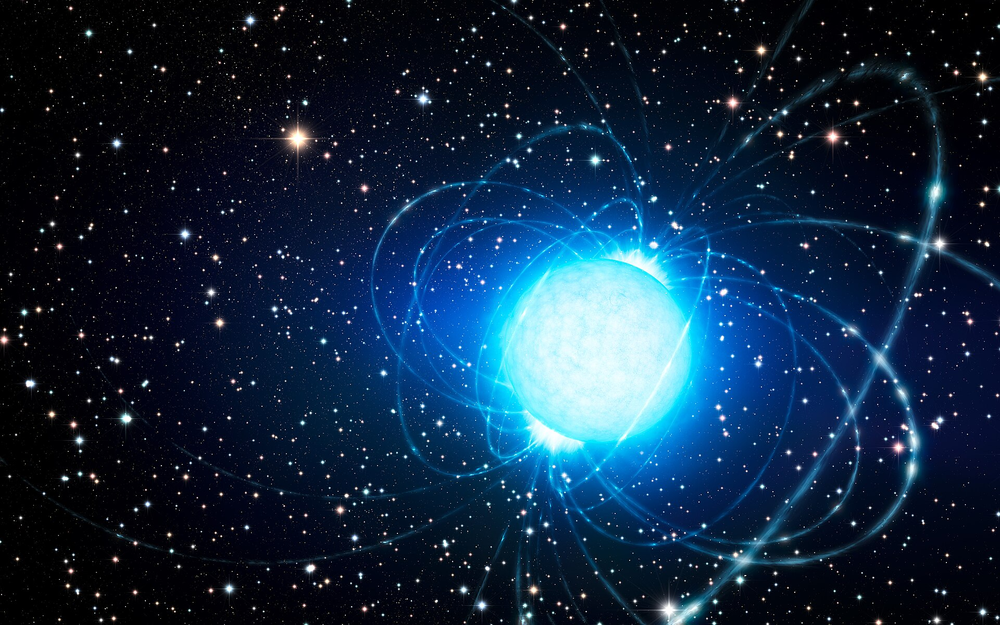
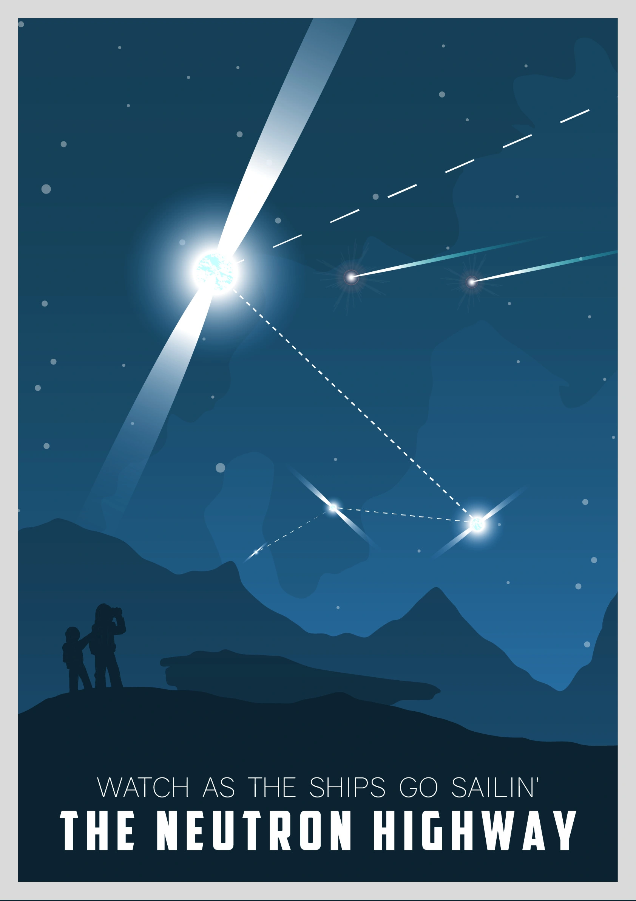

# Neutronen Sterne

## Wie entstehen Neutronen Sterne?

Alle Sterne in der Hauptreihe mit über 8 Solarmassen hat das Potenzial zu einem Neutronenstern zu werden.

Sterne sind während ihres Lebens immer in einem Kampf gegen die Gravitation. Die Nukleare Fusion des Sterns erzeugt genug Kraft nach außen um die Gravitation zu überwinden. Durch Stellare Nukleosynthese wird der Kern des Sternes immer reicher an Eisen, bis keine Nuclear Fusion mehr stattfinden kann. 

Da jetzt vom Stern keine Entgegenwirkende Kraft kommt, wird der Stern rasch komprimiert und es entsteht ein **Supernova**.

Es bleibt nur noch der Eisenkern über, der weiter komprimiert wird. Falls es über drei Solarmassen besirt, entsteht ein Schwarzes Loch, ansonsten wird der Eisenkern weiter komprimiert. Die Atome kommen so nah zu einander, dass die Elektronen mit den Protonen kollidieren und zu Neutronen werden. Es entsteht **Neutronium**. 

## Eigenschaften

- Behält den Drehimpuls vom Stern, jedoch viel kleiner und somit hat es eine sehr hohe Drehgeschwindigkeit.

- Haben eine Masse zwischen 1.17 M⊙ und 2.16 M⊙

- Radius zwischen 10 bis 15 km

- 1011 - 1012 K Innentemperatur

    - Fällt auf 10 6 K nach einigen Jahren

- Dichte von 3.7 × 1017 bis 5.9×1017 kg/m3

    - Ein Teelöffel von diesem Material würde 6 Trillionen Kilogram wiegen.

- Sehr starkes Magnetisches Feld

- Elektromagnetische Strahlung

    - Röntgen
    - Gamma-Ray Burst

### Struktur

- Oberfläche besteht aus Atomkernen mit frei fließenden Elektronen
    
    - Theorisiert, dass es aus Eisen besteht

- Im inneren Neutronen
    
    - Durch Gravitation sehr dicht zueinander
    - Nuclear Pasta

- Kern Komposition nicht genau bekannt

    - Strange matter
    - Superfluid Neutron-Degenerate-Matter

## Typen

### Pulsar

Ein Pulsar schießt Strahlung aus seinen Magnetischen Polen. Diese müssen nicht an der Rotationsachse sein. Diese Strahlung kann man von der Erde sehen. Der Pulsar "pulsiert". 

### Magnetar

Ein Magnetar hat ein sehr viel stärkeres magnetisches Feld im Vergleich zu normalen Neutronen Sternen.

## Entdeckung

- 1934: Walter Baade und Fritz Zwicky haben über die Existence von Neutronen Sterne theorisiert.

- 1967: Antony Hewish entdeckt den ersten Pulsar.

    - Crab Pulsar
    

## Darstellung in Medien

- Neutron Star - Larry Niven

    - Novelle

- Star Trek Folgen

- Star Wars - Lando 3 Comic

- Elite Dangerous

## Quellen

- [Wikipedia](https://en.wikipedia.org/wiki/Neutron_star)

- [Structural characteristics and physical properties of neutron stars: theoretical and observational research - Collazos J. Alfredo](https://arxiv.org/pdf/2303.08734)

- [Earthsky](https://earthsky.org/astronomy-essentials/definition-what-is-a-neutron-star/)

- [NASA](https://imagine.gsfc.nasa.gov/science/objects/neutron_stars1.html)